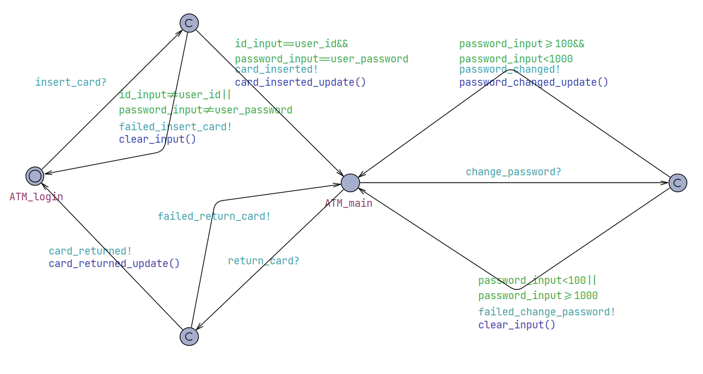

# Validation for Banking System

Team 5 Project 2
Made by: Panxin Tao

---

## Content

- [Validation for Banking System](#validation-for-banking-system)
  - [Content](#content)
  - [1 Unit Test](#1-unit-test)
    - [1.1 ATM](#11-atm)
      - [1.1.1 Create Account](#111-create-account)
      - [1.1.2 Close Account](#112-close-account)
      - [1.1.3 Insert Card](#113-insert-card)
      - [1.1.4 Return Card](#114-return-card)
      - [1.1.5 Deposit Cash](#115-deposit-cash)
      - [1.1.6 Withdraw Cash](#116-withdraw-cash)
    - [1.2 APP](#12-app)
      - [1.2.1 Log In](#121-log-in)
      - [1.2.2 Log Out](#122-log-out)
      - [1.2.3 Close APP](#123-close-app)
    - [1.3 Both](#13-both)
      - [1.3.1 Change Password](#131-change-password)
      - [1.3.2 Transfer\_money](#132-transfer_money)
  - [2 Integration Test](#2-integration-test)
    - [2.1 Test for ATM](#21-test-for-atm)
    - [2.2 Test for APP](#22-test-for-app)
  - [3 Functionality Test](#3-functionality-test)
    - [3.1 Use Case "Create account"](#31-use-case-create-account)
      - [3.1.1 Test "Create account with valid password"](#311-test-create-account-with-valid-password)
      - [3.1.2 Test "Create account with invalid password"](#312-test-create-account-with-invalid-password)
    - [3.2 Use Case "Close account"](#32-use-case-close-account)
      - [3.2.1 Test "Close account with nonzero balance"](#321-test-close-account-with-nonzero-balance)
      - [3.2.2 Test "Close account with zero balance"](#322-test-close-account-with-zero-balance)
    - [3.3 Use Case "Insert card"](#33-use-case-insert-card)
      - [3.3.1 Test "Insert card with correct id and password"](#331-test-insert-card-with-correct-id-and-password)
      - [3.3.2 Test "Insert card with invalid id"](#332-test-insert-card-with-invalid-id)
      - [3.3.3 Test "Insert card with incorrect password"](#333-test-insert-card-with-incorrect-password)
    - [3.4 Use Case "Return card"](#34-use-case-return-card)
    - [3.5 Use Case "Deposit money"](#35-use-case-deposit-money)
      - [3.5.1 Test "Deposit valid amount money"](#351-test-deposit-valid-amount-money)
      - [3.5.2 Test "Deposit invalid amount money"](#352-test-deposit-invalid-amount-money)
    - [3.6 Use Case "Withdraw money"](#36-use-case-withdraw-money)
      - [3.6.1 Test "Withdraw invalid amount money"](#361-test-withdraw-invalid-amount-money)
      - [3.6.2 Test "Withdraw valid amount money with sufficient balance"](#362-test-withdraw-valid-amount-money-with-sufficient-balance)
      - [3.6.3 Test "Withdraw valid amount money with insufficient balance"](#363-test-withdraw-valid-amount-money-with-insufficient-balance)
    - [3.7 Use Case "Log in"](#37-use-case-log-in)
      - [3.7.1 Test "Log in with correct id and password"](#371-test-log-in-with-correct-id-and-password)
      - [3.7.2 Test "Log in with invalid id"](#372-test-log-in-with-invalid-id)
      - [3.7.3 Test "Log in with incorrect password"](#373-test-log-in-with-incorrect-password)
      - [3.7.4 Test "Log in when the same account is logged in in another app"](#374-test-log-in-when-the-same-account-is-logged-in-in-another-app)
    - [3.8 Use Case "Log out"](#38-use-case-log-out)
    - [3.9 Use Case "Close app"](#39-use-case-close-app)
    - [3.10 Use Case "Change password"](#310-use-case-change-password)
      - [3.10.1 Test "Change password on ATM with valid new password"](#3101-test-change-password-on-atm-with-valid-new-password)
      - [3.10.2 Test "Change password on ATM with invalid new password"](#3102-test-change-password-on-atm-with-invalid-new-password)
      - [3.10.3 Test "Change password on APP with valid new password"](#3103-test-change-password-on-app-with-valid-new-password)
      - [3.10.4 Test "Change password on APP with invalid new password"](#3104-test-change-password-on-app-with-invalid-new-password)
    - [3.11 Use Case "Transfer money"](#311-use-case-transfer-money)
      - [3.11.1 Test "Transfer invalid amount money on ATM"](#3111-test-transfer-invalid-amount-money-on-atm)
      - [3.11.2 Test "Transfer money on ATM to nonexist account"](#3112-test-transfer-money-on-atm-to-nonexist-account)
      - [3.11.3 Test "Transfer money on ATM to valid account with insufficient balance"](#3113-test-transfer-money-on-atm-to-valid-account-with-insufficient-balance)
      - [3.11.4 Test "Transfer money on ATM to valid account with sufficient balance"](#3114-test-transfer-money-on-atm-to-valid-account-with-sufficient-balance)
      - [3.11.5 Test "Transfer invalid money on APP"](#3115-test-transfer-invalid-money-on-app)
      - [3.11.6 Test "Transfer money on APP to nonexist account"](#3116-test-transfer-money-on-app-to-nonexist-account)
      - [3.11.7 Test "Transfer money on APP to valid account with insufficient balance"](#3117-test-transfer-money-on-app-to-valid-account-with-insufficient-balance)
      - [3.11.8 Test "Transfer money on APP to valid account with sufficient balance"](#3118-test-transfer-money-on-app-to-valid-account-with-sufficient-balance)
    - [3.12 Use Case "Query"](#312-use-case-query)
      - [3.12.1 Test "Query on ATM"](#3121-test-query-on-atm)
      - [3.12.2 Test "Query on APP"](#3122-test-query-on-app)
  - [4 Risk Management](#4-risk-management)
    - [4.1 Risk Analysis and Evaluation](#41-risk-analysis-and-evaluation)
    - [4.2 Fault Tree Analysis](#42-fault-tree-analysis)
  - [5 Model Checking](#5-model-checking)
    - [5.1 Introduction](#51-introduction)
    - [5.2 Assumptions](#52-assumptions)
    - [5.3 ATM model1](#53-atm-model1)
      - [5.3.1 User](#531-user)
      - [5.3.2 ATM](#532-atm)
      - [5.3.3 Check Properties](#533-check-properties)
        - [5.3.3.1 no deadlock](#5331-no-deadlock)
        - [5.3.3.2 balance is non-negative](#5332-balance-is-non-negative)
        - [5.3.3.3 valid id](#5333-valid-id)
        - [5.3.3.4 valid password](#5334-valid-password)
        - [5.3.3.5 valid close account](#5335-valid-close-account)
    - [5.4 ATM model2](#54-atm-model2)
      - [5.4.1 User](#541-user)
      - [5.4.2 ATM](#542-atm)
      - [5.4.3 Check Properties](#543-check-properties)
        - [5.4.3.1 no deadlock](#5431-no-deadlock)
        - [5.4.3.2 valid password](#5432-valid-password)
        - [5.4.3.3 valid login with the correct id and password](#5433-valid-login-with-the-correct-id-and-password)
    - [5.5 ATM model](#55-atm-model)
      - [5.5.1 User](#551-user)
      - [5.5.2 ATM](#552-atm)
      - [5.5.3 Check Properties](#553-check-properties)
        - [5.5.3.1 no deadlock](#5531-no-deadlock)
        - [5.5.3.2 balance is non-negative](#5532-balance-is-non-negative)
        - [5.5.3.3 valid id](#5533-valid-id)
        - [5.5.3.4 valid password](#5534-valid-password)
        - [5.5.3.5 valid close account](#5535-valid-close-account)
        - [5.5.3.6 valid login with the correct id and password](#5536-valid-login-with-the-correct-id-and-password)
    - [5.6 APP model](#56-app-model)
      - [5.6.1 User](#561-user)
      - [5.6.2 APP](#562-app)
      - [5.6.3 Check Properties](#563-check-properties)
        - [5.6.3.1 no deadlock](#5631-no-deadlock)
        - [5.6.3.2 valid password](#5632-valid-password)
        - [5.6.3.3 valid login with the correct id and password](#5633-valid-login-with-the-correct-id-and-password)
    - [5.7 Transfer money model](#57-transfer-money-model)
      - [5.7.1 User](#571-user)
      - [5.7.2 Check Properties](#572-check-properties)
        - [5.7.2.1 no deadlock](#5721-no-deadlock)
        - [5.7.2.2 balance is non-negative](#5722-balance-is-non-negative)
        - [5.7.2.3 balance sum is fixed](#5723-balance-sum-is-fixed)

---

## 1 Unit Test

This section provides information of unit tests we made for every function with statement coverage, branch coverage and condition coverage criteria. Test functions for every tests using python unittest module are provided, and you can find corresponding file in "./src/test.py".

### 1.1 ATM
#### 1.1.1 Create Account

```python
def create_account(self, auto_password=None):
    if auto_password:
        # Automatic mode
        input_dialog = AutoInputDialog(self)
        input_dialog.setWindowTitle('创建账户')
        input_dialog.setLabelText('请输入你要创建的账户密码')
        input_dialog.set_auto_text(auto_password)  # Set the auto password and confirm
    else:
        # Manual mode
        input_dialog = QInputDialog(self)
        input_dialog.setWindowTitle('创建账户')
        input_dialog.setLabelText('请输入你要创建的账户密码')
  
    if input_dialog.exec_() == QDialog.Accepted:
        password = input_dialog.textValue()
        if (password.isdigit()==False) or len(password)<5 or len(password) > 12:
            msg_box = AutoCloseMessageBox(self)
            msg_box.setText('密码格式不正确，必须为5到12位的数字！')
            msg_box.exec_()
            return
        new_account = DataBase.generate_random_number()
        DataBase.account_balance[new_account] = 0
        DataBase.account_password[new_account] = password
        # Use auto-closing message box
        msg_box = AutoCloseMessageBox(self)
        msg_box.setText(f'创建账户成功！\n您的账户为{new_account}\n密码为: {password}')
        msg_box.exec_()
        DataBase.ATM_current_account=new_account
        self.deleteLater()
        self.cams = ATMmain(self.x,self.y)
        self.cams.show()

        global ATM_current_window
        ATM_current_window=self.cams

        zmqThread.sendMsg("account_created@"+ str(new_account))  
```

- Coverage Criteria: Condition coverage
- Test Function: ./src/test.py/test_create_account
- Test Case

|                 | T1.1.1.1                      | T1.1.1.2                            | T1.1.1.3                            | T1.1.1.4                            |
| --------------- | ----------------------------- | ----------------------------------- | ----------------------------------- | ----------------------------------- |
| Input           | "123456"                      | "abc123"                            | "123"                               | "1234567890123"                     |
| Coverage Item   | Tcover1.1.1.1                 | Tcover1.1.1.2                       | Tcover1.1.1.3                       | Tcover1.1.1.4                       |
| State           | 3 accounts                    | 4 accounts                          | 4 accounts                          | 4 accounts                          |
| Expected Output | 4 accounts<br>account_created | 4 accounts<br>failed_create_account | 4 accounts<br>failed_create_account | 4 accounts<br>failed_create_account |
| Test Result     | Passed                        | Passed                              | Passed                              | Passed                              |

#### 1.1.2 Close Account

```python
def close(self):
    # if self.isVisible():  # 检查窗口是否可见，从而判断其是否有效
    if float(DataBase.account_balance[DataBase.ATM_current_account]) > 0:
        msg_box = AutoCloseMessageBox(self)
        msg_box.setText(f'注销账户时应确保账户余额清零！\n您当前的账户余额为{DataBase.account_balance[DataBase.ATM_current_account]}￥')
        msg_box.exec_()
        zmqThread.sendMsg("failed@close_acount")
    else:
        if DataBase.ATM_current_account in DataBase.account_balance:
            del DataBase.account_balance[DataBase.ATM_current_account]
        if DataBase.ATM_current_account in DataBase.account_password:
            del DataBase.account_password[DataBase.ATM_current_account]

        msg_box = AutoCloseMessageBox(self)
        msg_box.setText(f'账户 {DataBase.ATM_current_account} 已成功删除🙂')
        msg_box.show()
        msg_box.exec_()
        self.deleteLater()
        self.cams = ATMlog(self.x,self.y)
        global ATM_current_window
        ATM_current_window=self.cams
        zmqThread.sendMsg("account_closed@"+ str(DataBase.ATM_current_account))
```

- Coverage Criteria: Branch coverage
- Test Function: ./src/test.py/test_close_account
- Test Case

|                 | T1.1.2.1             | T1.1.2.2       |
| --------------- | -------------------- | -------------- |
| Input           | /                    | /              |
| Coverage Item   | Tcover1.1.2.1        | Tcover1.1.2.2  |
| State           | balance=500          | balance=0      |
| Expected Output | failed_close_account | account_closed |
| Test Result     | Passed               | Passed         |

#### 1.1.3 Insert Card

```python
def confirm(self):
    card_number=self.ui.card_number.text()
    card_password=self.ui.card_password.text()
    if card_number in DataBase.account_password:
        if DataBase.account_password[card_number] == card_password:  
            msg_box = AutoCloseMessageBox(self)
            msg_box.setText("绑定成功！")
            msg_box.exec_()
            DataBase.ATM_current_account=card_number
            self.deleteLater()
            self.cams = ATMmain(self.x,self.y)
            self.cams.show()

            global ATM_current_window
            ATM_current_window=self.cams

            zmqThread.sendMsg("card_inserted@"+ str(card_number))

        else:
            msg_box = AutoCloseMessageBox(self)
            msg_box.setText("绑定失败，银行卡密码错误！")
            msg_box.exec_()
            zmqThread.sendMsg(f"failed@insert_card")
    else:
        msg_box = AutoCloseMessageBox(self)
        msg_box.setText("绑定失败，未查询到该银行账户！")
        msg_box.exec_()
        zmqThread.sendMsg(f"failed@insert_card")
```

- Coverage Criteria: Branch coverage
- Test Function: ./src/test.py/test_insert_card
- Test Case

|                 | T1.1.3.1                  | T1.1.3.2                        | T1.1.3.3                        |
| --------------- | ------------------------- | ------------------------------- | ------------------------------- |
| Input           | ("2023123456", "111111")  | ("33333", "33333")              | ("22222", "11111")              |
| Coverage Item   | Tcover1.1.3.1             | Tcover1.1.3.2                   | Tcover1.1.3.3                   |
| State           | ATM_login                 | ATM_login                       | ATM_login                       |
| Expected Output | ATM_main<br>card_inserted | ATM_login<br>failed_insert_card | ATM_login<br>failed_insert_card |
| Test Result     | Passed                    | Passed                          | Passed                          |

#### 1.1.4 Return Card

```python
def out(self):
    self.deleteLater()
    self.cams = ATMlog(self.x,self.y)
    self.cams.show()  
    global ATM_current_window
    ATM_current_window=self.cams
    zmqThread.sendMsg("card_returned@"+ str(DataBase.ATM_current_account))
```

- Coverage Criteria: Statement coverage
- Test Function: ./src/test.py/test_return_card
- Test Case

|                 | T1.1.4.1      |
| --------------- | ------------- |
| Input           | /             |
| Coverage Item   | Tcover1.1.4.1 |
| State           | ATM_main      |
| Expected Output | ATM_login     |
| Test Result     | Passed        |

#### 1.1.5 Deposit Cash
```python
def recharge(self):
    def is_two_decimal(number):
        return round(number, 2) == number 
    recharge_amount, ok = QInputDialog.getText(self, '充值', '请输入你要充值的金额:')
    if ok:
        try:
            # 检查输入是否为纯数字
            recharge_amount = float(recharge_amount)
        except ValueError:
            QMessageBox.warning(self, '错误', '请输入有效的数字金额')
            return
        # 检查充值金额是否小于0.01￥
        if recharge_amount < 0.01:
            QMessageBox.warning(self, '错误', '充值金额必须大于等于0.01￥')
            return
        # 检查充值金额是否合理
        if not is_two_decimal(recharge_amount):
            QMessageBox.warning(self, '错误', '充值金额必须为0.01￥的整数倍')
            return
        if (float(recharge_amount))%100!=0:
            QMessageBox.warning(self, '错误', '充值金额必须为100￥的整数倍')
            return
        # 更新账户余额
        DataBase.account_balance[DataBase.ATM_current_account] = float(DataBase.account_balance[DataBase.ATM_current_account])+float(recharge_amount)
        DataBase.account_balance[DataBase.ATM_current_account] = DataBase.account_balance[DataBase.ATM_current_account]
        # 更新交易流水
        if DataBase.ATM_current_account not in DataBase.detail:
            DataBase.detail[DataBase.ATM_current_account] = []
        DataBase.detail[DataBase.ATM_current_account].append([DataBase.account_balance[DataBase.ATM_current_account], '充值', recharge_amount, current_datetime])
    self.ui.balance.setText(str(DataBase.account_balance[DataBase.ATM_current_account]))
```

- Coverage Criteria: Branch coverage
- Test Function: ./src/test.py/test_deposit
- Test Case

|                 | T1.1.5.1                      | T1.1.5.2                           | T1.1.5.3                           |
| --------------- | ----------------------------- | ---------------------------------- | ---------------------------------- |
| Input           | "200"                         | "-100"                             | "abc"                              |
| Coverage Item   | Tcover1.1.5.1                 | Tcover1.1.5.2                      | Tcover1.1.5.3                      |
| State           | balance=0                     | balance=200                        | balance=200                        |
| Expected Output | balance=200<br>cash_deposited | balance=200<br>failed_deposit_cash | balance=200<br>failed_deposit_cash |
| Test Result     | Passed                        | Passed                             | Passed                             |

#### 1.1.6 Withdraw Cash
```python
def withdraw(self):
    def is_two_decimal(number):
        return round(number, 2) == number 
    withdraw_amount, ok = QInputDialog.getText(self, '提现', '请输入你要提现的金额:')
    if ok:
        try:
            # 检查输入是否为纯数字
            withdraw_amount = float(withdraw_amount)
        except ValueError:
            QMessageBox.warning(self, '错误', '请输入有效的数字金额')
            return
        # 检查充值金额是否小于0.01￥
        if withdraw_amount < 0.01:
            QMessageBox.warning(self, '错误', '取款金额必须大于等于0.01￥')
            return
        # 检查充值金额是否合理
        if not is_two_decimal(withdraw_amount):
            QMessageBox.warning(self, '错误', '取款金额必须为0.01￥的整数倍')
            return
        # 检查提现金额是否小于等于当前余额
        if float(withdraw_amount) > float(DataBase.account_balance[DataBase.ATM_current_account]):
            QMessageBox.warning(self, '错误', '取款金额不能大于当前账户余额')
            return
        # 更新账户余额
        DataBase.account_balance[DataBase.ATM_current_account] = float(DataBase.account_balance[DataBase.ATM_current_account])-float(withdraw_amount)
        DataBase.account_balance[DataBase.ATM_current_account] = DataBase.account_balance[DataBase.ATM_current_account]

        # 更新交易流水
        if DataBase.ATM_current_account not in DataBase.detail:
            DataBase.detail[DataBase.ATM_current_account] = []
        DataBase.detail[DataBase.ATM_current_account].append([DataBase.account_balance[DataBase.ATM_current_account], '取款', withdraw_amount, current_datetime])

        # 显示取款成功信息
        msg_box = AutoCloseMessageBox(self)
        msg_box.setText(f'取款成功，您当前的账户余额为: {DataBase.account_balance[DataBase.ATM_current_account]}元')
        msg_box.exec_()
        self.ui.balance.setText(str(DataBase.account_balance[DataBase.ATM_current_account]))  # 更新界面显示的余额
```

- Coverage Criteria: Branch coverage
- Test Function: ./src/test.py/test_withdraw
- Test Case

|                 | T1.1.6.1                      | T1.1.6.2                            | T1.1.6.3                            | T1.1.6.4                            |
| --------------- | ----------------------------- | ----------------------------------- | ----------------------------------- | ----------------------------------- |
| Input           | "300"                         | "300"                               | "-100"                              | "abc"                               |
| Coverage Item   | Tcover1.1.6.1                 | Tcover1.1.6.2                       | Tcover1.1.6.3                       | Tcover1.1.6.4                       |
| State           | balance=500                   | balance=200                         | balance=200                         | balance=200                         |
| Expected Output | balance=200<br>cash_withdrawn | balance=200<br>failed_withdraw_cash | balance=200<br>failed_withdraw_cash | balance=200<br>failed_withdraw_cash |
| Test Result     | Passed                        | Passed                              | Passed                              | Passed                              |

### 1.2 APP
#### 1.2.1 Log In
```python
def confirm(self):
    global app_current_account
    global app_current_account_password
    global app_current_account_balance
    card_number=self.ui.card_number.text()
    card_password=self.ui.card_password.text()
    if card_number in DataBase.account_password:
        if DataBase.account_password[card_number] == card_password:    
            msg_box = AutoCloseMessageBox(self)
            msg_box.setText("绑定成功！")
            msg_box.exec_()
            # 关闭当前窗口，并打开主窗口
            if (DataBase.auto==0):
                for i in range(len(DataBase.manual_instances)):
                    if DataBase.manual_instances[i].account==card_number:
                        DataBase.manual_instances[i].out()
                        #del DataBase.manual_instances[i]
            else:
                for name, instance in DataBase.app_instances.items():
                    if(hasattr(instance,'account')):
                        if instance.account==card_number and (instance.is_active==False):
                            DataBase.app_instances[name].out()
                            #  zmqThread.sendMsg(f"logged_in@{card_number}#{name[3:]} 
            self.account=card_number
            app_current_account=card_number
            app_current_account_password=DataBase.account_password[app_current_account]
            app_current_account_balance=DataBase.account_balance[app_current_account]
            self.deleteLater()
            self.cams = appmain(self.x,self.y)
            self.cams.show()
            if(DataBase.auto==0):
                self.cams.account=card_number
                DataBase.manual_instances.append(self.cams)
            else:
                for name, instance in DataBase.app_instances.items():
                    if(hasattr(instance,'is_active')):
                        if instance.is_active:
                            DataBase.app_instances[name] = self.cams
                            setattr(self.cams, 'account', card_number)
                            zmqThread.sendMsg(f"logged_in@{card_number}#{name[3:]}")
        else:
            msg_box = AutoCloseMessageBox(self)
            msg_box.setText("绑定失败，银行卡密码错误！")
            msg_box.exec_()
            if (DataBase.auto==1):
                for name, instance in DataBase.app_instances.items():
                    if instance.is_active:
                        zmqThread.sendMsg(f"failed@log_in#{name[3:]}")
    else:
        msg_box = AutoCloseMessageBox(self)
        msg_box.setText("绑定失败，未查询到该银行账户！")
        msg_box.exec_()
        if (DataBase.auto==1):
            for name, instance in DataBase.app_instances.items():
                if instance.is_active:
                    zmqThread.sendMsg(f"failed@log_in#{name[3:]}")

```

- Coverage Criteria: Branch coverage
- Test Function: ./src/test.py/test_log_in
- Test Case

|                 | T1.2.1.1                 | T1.2.1.2                   | T1.2.1.3                   |
| --------------- | ------------------------ | -------------------------- | -------------------------- |
| Input           | ("2023123456", "111111") | ("33333", "33333")         | ("22222", "11111")         |
| Coverage Item   | Tcover1.1.3.1            | Tcover1.1.3.2              | Tcover1.1.3.3              |
| State           | APP_login                | APP_login                  | APP_login                  |
| Expected Output | APP_main<br>logged_in    | APP_login<br>failed_log_in | APP_login<br>failed_log_in |
| Test Result     | Passed                   | Passed                     | Passed                     |

#### 1.2.2 Log Out
```python
def out(self):
    global app_current_account
    if (DataBase.auto==0):
        for i in range(len(DataBase.manual_instances)):
            if DataBase.manual_instances[i].account==self.app_current_account:
                del DataBase.manual_instances[i]
        self.deleteLater()
        self.cams = applog(self.x,self.y)
        self.cams.show()  
    else:
        for name, instance in DataBase.app_instances.items():
            if(hasattr(instance,'account')):
                if instance.account==self.app_current_account and (instance.is_active==False):
                    instance.account=0
                    self.deleteLater()
                    self.cams = applog(self.x,self.y)
                    self.cams.show()  
                    DataBase.app_instances[name]=self.cams
                    return
                
        for name, instance in DataBase.app_instances.items():
            if instance.is_active==True:
                self.deleteLater()
                self.cams = applog(self.x,self.y)
                self.cams.show()  
                DataBase.app_instances[name]=self.cams
```

- Coverage Criteria: Statement coverage
- Test Function: ./src/test.py/test_log_out
- Test Case

|                 | T1.2.2.1      |
| --------------- | ------------- |
| Input           | /             |
| Coverage Item   | Tcover1.2.2.1 |
| State           | APP_main      |
| Expected Output | APP_login     |
| Test Result     | Passed        |

#### 1.2.3 Close APP
- Coverage Criteria: Statement coverage
- Test Function: ./src/test.py/test_close_app
- Test Case

|                 | T1.2.3.1      |
| --------------- | ------------- |
| Input           | /             |
| Coverage Item   | Tcover1.2.3.1 |
| State           | APP_main      |
| Expected Output | NULL          |
| Test Result     | Passed        |

### 1.3 Both
#### 1.3.1 Change Password
```python
def auto_change_password(self, new_password, automated_test=False):
    if automated_test:
        # 在自动化测试中自动填充并接受密码
        input_dialog = AutoInputDialog(self)
        input_dialog.setWindowTitle('修改密码')
        input_dialog.setLabelText('请输入你要修改的密码:')
        input_dialog.set_auto_text(new_password, 500)  # 延迟0.5秒自动填充
        if input_dialog.exec_() == QDialog.Accepted:
            new_password = input_dialog.textValue()
        else:
            return  # 如果对话框没有被接受，直接返回
    # 验证新密码是否与原密码一致
    if new_password == DataBase.account_password[DataBase.ATM_current_account]:
        msg_box = AutoCloseMessageBox(self)
        msg_box.setText('修改密码失败，新密码不能与原密码一致😔')
        msg_box.exec_()
        if automated_test:
            zmqThread.sendMsg("failed@change_password")
        return
    
    if (new_password.isdigit()==False) or len(new_password)<5 or len(new_password) > 12:
        msg_box = AutoCloseMessageBox(self)
        msg_box.setText('密码格式不正确，必须为5到12位的数字！')
        msg_box.exec_()
        if automated_test:
            zmqThread.sendMsg(f"failed@change_password")
        return

    # 修改密码
    DataBase.account_password[DataBase.ATM_current_account] = new_password  # 更新当前的账户密码
    DataBase.account_password[DataBase.ATM_current_account] = new_password  # 更新数据库里的账户密码
    # 显示成功信息
    msg_box = AutoCloseMessageBox(self)
    msg_box.setText(f'修改密码成功，您的新密码为🙂: {new_password}')
    msg_box.exec_()
```

- Coverage Criteria: Condition coverage
- Test Function: ./src/test.py/test_change_password
- Test Case

|                 | T1.3.1.1                              | T1.3.1.2                                    | T1.3.1.3                                    | T1.3.1.4                                    |
| --------------- | ------------------------------------- | ------------------------------------------- | ------------------------------------------- | ------------------------------------------- |
| Input           | "123456"                              | "abc123"                                    | "123"                                       | "1234567890123"                             |
| Coverage Item   | Tcover1.3.1.1                         | Tcover1.3.1.2                               | Tcover1.3.1.3                               | Tcover1.3.1.4                               |
| State           | password="111111"                     | password="123456"                           | password="123456"                           | password="123456"                           |
| Expected Output | password="123456"<br>password_changed | password="123456"<br>failed_change_password | password="123456"<br>failed_change_password | password="123456"<br>failed_change_password |
| Test Result     | Passed                                | Passed                                      | Passed                                      | Passed                                      |

#### 1.3.2 Transfer_money
```python
def auto_transfer(self, dest_num, amount):
    # First, handle the destination number
    input_dialog = AutoInputDialog(self)
    input_dialog.setWindowTitle('转账')
    input_dialog.setLabelText('请输入你要转账的目标账户:')
    input_dialog.set_auto_text(dest_num, 1000)

    if input_dialog.exec_() == QDialog.Accepted:
        if dest_num not in DataBase.account_balance or dest_num == DataBase.ATM_current_account:
            msg_box = AutoCloseMessageBox(self)
            msg_box.setText('错误: 目标账户无效或不能转账给自己')
            msg_box.exec_()
            zmqThread.sendMsg("failed@transfer_money")
            return

        # Second, handle the transfer amount
        input_dialog = AutoInputDialog(self)
        input_dialog.setWindowTitle('转账')
        input_dialog.setLabelText('请输入你要转账的金额:')
        input_dialog.set_auto_text(amount, 1000)

        if input_dialog.exec_() == QDialog.Accepted:
            transfer_amount = float(amount)
            try:
                transfer_amount = float(transfer_amount)
                if float(transfer_amount) < 0.01 or not self.is_two_decimal(transfer_amount) or float(transfer_amount) > float(DataBase.account_balance[DataBase.ATM_current_account]):
                    msg_box = AutoCloseMessageBox(self)
                    msg_box.setText('错误: 交易金额无效或超出账户余额')
                    msg_box.exec_()
                    zmqThread.sendMsg("failed@transfer_money")
                    return

                # Perform the transfer
                DataBase.account_balance[DataBase.ATM_current_account] = float(DataBase.account_balance[DataBase.ATM_current_account])-float(transfer_amount)
                DataBase.account_balance[dest_num] = float(DataBase.account_balance[dest_num])+float(transfer_amount)

                # Update transaction history
                if DataBase.ATM_current_account not in DataBase.detail:
                    DataBase.detail[DataBase.ATM_current_account] = []
                DataBase.detail[DataBase.ATM_current_account].append([DataBase.account_balance[DataBase.ATM_current_account], f'向{dest_num}账户转出', transfer_amount, current_datetime])

                if dest_num not in DataBase.detail:
                    DataBase.detail[dest_num] = []
                DataBase.detail[dest_num].append([DataBase.account_balance[dest_num], f'由{DataBase.ATM_current_account}账户转入', transfer_amount, current_datetime])

                # Success message
                msg_box = AutoCloseMessageBox(self)
                msg_box.setText(f'转账成功，您当前的账户余额为: {DataBase.account_balance[DataBase.ATM_current_account]}元')
                msg_box.exec_()

                self.ui.balance.setText(str(DataBase.account_balance[DataBase.ATM_current_account]))
            except ValueError:
                msg_box = AutoCloseMessageBox(self)
                msg_box.setText('错误: 请输入有效的交易金额')
                msg_box.exec_()
                zmqThread.sendMsg(f"failed@transfer_money")
                return
```

- Coverage Criteria: Branch coverage
- Test Function: ./src/test.py/test_transfer_money
- Test Case

|                 | T1.3.2.1                         | T1.3.2.2                             | T1.3.2.3                             | T1.3.2.4                             | T1.3.2.5                             |
| --------------- | -------------------------------- | ------------------------------------ | ------------------------------------ | ------------------------------------ | ------------------------------------ |
| Input           | ("22222","100")                  | ("22222","600")                      | ("33333","100")                      | ("22222","abc")                      | ("22222","-100")                     |
| Coverage Item   | Tcover1.3.2.1                    | Tcover1.3.2.2                        | Tcover1.3.2.3                        | Tcover1.3.2.4                        | Tcover1.3.2.5                        |
| State           | balance=500                      | balance=400                          | balance=500                          | balance=500                          | balance=500                          |
| Expected Output | balance=400<br>money_transferred | balance=400<br>failed_transfer_money | balance=400<br>failed_transfer_money | balance=400<br>failed_transfer_money | balance=400<br>failed_transfer_money |
| Test Result     | Passed                           | Passed                               | Passed                               | Passed                               | Passed                               |

## 2 Integration Test
This section provides information of integration tests we made for the banking system. Testing cases with runnable test functions are provided and you can find it in "./src/My_test/main.py"

### 2.1 Test for ATM
|                 | Test Case T2.1                                                                                                                                                                                                                                                                                                                                                                                                                                                                                                                                                                                                                                     |
| --------------- | -------------------------------------------------------------------------------------------------------------------------------------------------------------------------------------------------------------------------------------------------------------------------------------------------------------------------------------------------------------------------------------------------------------------------------------------------------------------------------------------------------------------------------------------------------------------------------------------------------------------------------------------------- |
| Operation       | create_account@abc123<br>create_account@123<br>create_account@1234567890123<br>create_account@123456<br>deposit_cash@abc<br>deposit_cash@-1000<br>deposit_cash@2000<br>return_card<br>insert_card@33333<br>insert_card@11111<br>withdraw_cash@1000@33333<br>withdraw_cash@-1000@123456<br>withdraw_cash@abc@123456<br>withdraw_cash@1000@123456<br>transfer_money@33333@500<br>transfer_money@22222@abc<br>transfer_money@22222@-500<br>close_account<br>transfer_money@22222@2000<br>transfer_money@22222@1000<br>change_password@654321<br>change_password@abc<br>change_password@123<br>change_password@1234567890123<br>query<br>close_account |
| Coverage Item   | Tcover1.1.1.1<br>Tcover1.1.1.2<br>Tcover1.1.1.3<br>Tcover1.1.1.4<br>Tcover1.1.2.1<br>Tcover1.1.2.2<br>Tcover1.1.3.1<br>Tcover1.1.3.2<br>Tcover1.1.3.3<br>Tcover1.1.4.1<br>Tcover1.1.5.1<br>Tcover1.1.5.2<br>Tcover1.1.5.3<br>Tcover1.1.6.1<br>Tcover1.1.6.2<br>Tcover1.1.6.3<br>Tcover1.1.6.4<br>Tcover1.3.1.1<br>Tcover1.3.1.2<br>Tcover1.3.1.3<br>Tcover1.3.1.4<br>Tcover1.3.2.1<br>Tcover1.3.2.2<br>Tcover1.3.2.3<br>Tcover1.3.2.4<br>Tcover1.3.2.5                                                                                                                                                                                             |
| Expected Output | failed_create_account<br>failed_create_account<br>failed_create_account<br>account_created<br>failed_deposit_money<br>failed_deposit_money<br>money_deposited<br>card_returned<br>failed_insert_card<br>card_inserted<br>failed_withdraw_money<br>failed_withdraw_money<br>failed_withdraw_money<br>money_withdrawn<br>failed_transfer_money<br>failed_transfer_money<br>failed_transfer_money<br>failed_close_account<br>money_transferred<br>failed_transfer_money<br>password_changed<br>failed_change_password<br>failed_change_password<br>failed_change_password<br>query_showed<br>account_closed                                           |
| Test Result     | Passed                                                                                                                                                                                                                                                                                                                                                                                                                                                                                                                                                                                                                                             |

### 2.2 Test for APP
|                 | Test Case T2.2                                                                                                                                                                                                                                                                                                                                                              |
| --------------- | --------------------------------------------------------------------------------------------------------------------------------------------------------------------------------------------------------------------------------------------------------------------------------------------------------------------------------------------------------------------------- |
| Operation       | open_app<br>open_app<br>log_in@11111@22222#1<br>log_in@33333@11111#1<br>log_in@11111@11111#1<br>log_in@22222@22222#2<br>transfer_money@11111@1000#2<br>transfer_money@22222@500#1<br>transfer_money@11111@1000#2<br>change_password@abc123#1<br>change_password@123#1<br>change_password@1234567890123#2<br>change_password@654321#2<br>log_out#2<br>query#1<br>close_app#1 |
| Coverage Item   | Tcover1.2.1.1<br>Tcover1.2.1.2<br>Tcover1.2.1.3<br>Tcover1.2.2.1<br>Tcover1.2.3.1<br>Tcover1.3.1.1<br>Tcover1.3.1.2<br>Tcover1.3.1.3<br>Tcover1.3.1.4<br>Tcover1.3.2.1<br>Tcover1.3.2.2                                                                                                                                                                                     |
| Expected Output | app_opened#1<br>app_opened#2<br>failed_log_in#1<br>failed_log_in#1<br>logged_in#1<br>logged_in#2<br>failed_transfer_money#2<br>money_transferred#1<br>money_transferred#2<br>failed_change_password#1<br>failed_change_password#1<br>failed_change_password#2<br>password_changed#2<br>logged_out#2<br>query_showed#1<br>app_closed#1                                       |
| Test Result     | Passed                                                                                                                                                                                                                                                                                                                                                                      |

## 3 Functionality Test
This section provides information of functionality tests we made for the banking system with commonly seen use cases.

Without additional instructions, the test start with the following state:
```python
account_password={'2023123456':'111111','22222':'22222','11111':'11111'}
account_balance={'2023123456':'0','22222':'500','11111':'500'}
ATM_current_account=0
app_instances = {}  
```

### 3.1 Use Case "Create account"
#### 3.1.1 Test "Create account with valid password"

|                 | Test Case T3.1.1                                                         |
| --------------- | ------------------------------------------------------------------------ |
| Operation       | create_account@654321                                                    |
| State           | default                                                                  |
| Expected Output | account_created<br>show ATM_main<br>database added corresponding account |
| Test Result     | Passed                                                                   |

#### 3.1.2 Test "Create account with invalid password"

|                 | Test Case T3.1.2.1    | Test Case T3.1.2.2    | Test Case T3.1.2.3           |
| --------------- | --------------------- | --------------------- | ---------------------------- |
| Operation       | create_account@abc123 | create_account@123    | create_account@1234567890123 |
| State           | default               | default               | default                      |
| Expected Output | failed_create_account | failed_create_account | failed_create_account        |
| Test Result     | Passed                | Passed                | Passed                       |

### 3.2 Use Case "Close account"
#### 3.2.1 Test "Close account with nonzero balance"

|                 | Test Case T3.2.1          |
| --------------- | ------------------------- |
| Operation       | close_account             |
| State           | ATM_current_account=22222 |
| Expected Output | failed_close_account      |
| Test Result     | Passed                    |

#### 3.2.2 Test "Close account with zero balance"

|                 | Test Case T3.2.2                                                          |
| --------------- | ------------------------------------------------------------------------- |
| Operation       | close_account                                                             |
| State           | ATM_current_account=2023123456                                            |
| Expected Output | account_closed<br>show ATM_login<br>database delete corresponding account |
| Test Result     | Passed                                                                    |

### 3.3 Use Case "Insert card"

#### 3.3.1 Test "Insert card with correct id and password"

|                 | Test Case T3.3.1               |
| --------------- | ------------------------------ |
| Operation       | insert_card@11111@11111        |
| State           | default                        |
| Expected Output | card_inserted<br>show ATM_main |
| Test Result     | Passed                         |

#### 3.3.2 Test "Insert card with invalid id"

|                 | Test Case T3.3.2        |
| --------------- | ----------------------- |
| Operation       | insert_card@33333@11111 |
| State           | default                 |
| Expected Output | failed_insert_card      |
| Test Result     | Passed                  |

#### 3.3.3 Test "Insert card with incorrect password"

|                 | Test Case T3.3.3        |
| --------------- | ----------------------- |
| Operation       | insert_card@11111@22222 |
| State           | default                 |
| Expected Output | failed_insert_card      |
| Test Result     | Passed                  |

### 3.4 Use Case "Return card"

|                 | Test Case T3.4            |
| --------------- | ------------------------- |
| Operation       | return_card               |
| State           | ATM_current_account=11111 |
| Expected Output | card_returned             |
| Test Result     | Passed                    |

### 3.5 Use Case "Deposit money"
#### 3.5.1 Test "Deposit valid amount money"

|                 | Test Case T3.5.1                                         |
| --------------- | -------------------------------------------------------- |
| Operation       | deposit_money@500                                        |
| State           | ATM_current_account=2023123456                           |
| Expected Output | money_deposited<br>database update corresponding balance |
| Test Result     | Passed                                                   |

#### 3.5.2 Test "Deposit invalid amount money"

|                 | Test Case T3.5.2.1        | Test Case T3.5.2.2        | Test Case T3.5.2.3        |
| --------------- | ------------------------- | ------------------------- | ------------------------- |
| Operation       | deposit_money@-500        | deposit_money@0.00001     | deposit_money@abc         |
| State           | ATM_current_account=11111 | ATM_current_account=11111 | ATM_current_account=11111 |
| Expected Output | failed_deposit_money      | failed_deposit_money      | failed_deposit_money      |
| Test Result     | Passed                    | Passed                    | Passed                    |

### 3.6 Use Case "Withdraw money"
#### 3.6.1 Test "Withdraw invalid amount money"

|                 | Test Case T3.6.1.1        | Test Case T3.6.1.2        | Test Case T3.6.1.3        |
| --------------- | ------------------------- | ------------------------- | ------------------------- |
| Operation       | withdraw_money@-500       | withdraw_money@0.00001    | withdraw_money@abc        |
| State           | ATM_current_account=11111 | ATM_current_account=11111 | ATM_current_account=11111 |
| Expected Output | failed_withdraw_money     | failed_withdraw_money     | failed_withdraw_money     |
| Test Result     | Passed                    | Passed                    | Passed                    |

#### 3.6.2 Test "Withdraw valid amount money with sufficient balance"

|                 | Test Case T3.6.2                                         |
| --------------- | -------------------------------------------------------- |
| Operation       | withdraw_money@500                                       |
| State           | ATM_current_account=11111                                |
| Expected Output | money_withdrawn<br>database update corresponding balance |
| Test Result     | Passed                                                   |

#### 3.6.3 Test "Withdraw valid amount money with insufficient balance"

|                 | Test Case T3.6.3          |
| --------------- | ------------------------- |
| Operation       | withdraw_money@1000       |
| State           | ATM_current_account=11111 |
| Expected Output | failed_withdraw_money     |
| Test Result     | Passed                    |

### 3.7 Use Case "Log in"
#### 3.7.1 Test "Log in with correct id and password"

|                 | Test Case T3.7.1           |
| --------------- | -------------------------- |
| Operation       | log_in@11111@11111#1       |
| State           | default                    |
| Expected Output | logged_in<br>show APP_main |
| Test Result     | Passed                     |

#### 3.7.2 Test "Log in with invalid id"

|                 | Test Case T3.7.2          |
| --------------- | ------------------------- |
| Operation       | insert_card@33333@11111#1 |
| State           | default                   |
| Expected Output | failed_log_in             |
| Test Result     | Passed                    |

#### 3.7.3 Test "Log in with incorrect password"

|                 | Test Case T3.7.3          |
| --------------- | ------------------------- |
| Operation       | insert_card@11111@22222#1 |
| State           | default                   |
| Expected Output | failed_log_in             |
| Test Result     | Passed                    |

#### 3.7.4 Test "Log in when the same account is logged in in another app"

|                 | Test Case T3.7.4              |
| --------------- | ----------------------------- |
| Operation       | insert_card@11111@11111#2     |
| State           | app_instances = {"1":"11111"} |
| Expected Output | failed_log_in                 |
| Test Result     | Passed                        |

### 3.8 Use Case "Log out"

|                 | Test Case T3.8                     |
| --------------- | ---------------------------------- |
| Operation       | log_out#1                          |
| State           | app_instances = {"1":"11111"}      |
| Expected Output | logged_out<br>app_instances update |
| Test Result     | Passed                             |

### 3.9 Use Case "Close app"

|                 | Test Case T3.9                     |
| --------------- | ---------------------------------- |
| Operation       | close_app#1                        |
| State           | app_instances = {"1":"11111"}      |
| Expected Output | app_closed<br>app_instances update |
| Test Result     | Passed                             |

### 3.10 Use Case "Change password"
#### 3.10.1 Test "Change password on ATM with valid new password"

|                 | Test Case T3.10.1                    |
| --------------- | ------------------------------------ |
| Operation       | change_password@654321               |
| State           | ATM_current_account=2023123456       |
| Expected Output | password_changed<br>password updates |
| Test Result     | Passed                               |

#### 3.10.2 Test "Change password on ATM with invalid new password"

|                 | Test Case T3.10.2.1            | Test Case T3.10.2.2            | Test Case T3.10.2.3            |
| --------------- | ------------------------------ | ------------------------------ | ------------------------------ |
| Operation       | change_password@abc123         | change_password@123            | change_password@1234567890123  |
| State           | ATM_current_account=2023123456 | ATM_current_account=2023123456 | ATM_current_account=2023123456 |
| Expected Output | failed_change_password         | failed_change_password         | failed_change_password         |
| Test Result     | Passed                         | Passed                         | Passed                         |

#### 3.10.3 Test "Change password on APP with valid new password"

|                 | Test Case T3.10.3                    |
| --------------- | ------------------------------------ |
| Operation       | change_password@654321#1             |
| State           | app_instances = {"1":"11111"}        |
| Expected Output | password_changed<br>password updates |
| Test Result     | Passed                               |

#### 3.10.4 Test "Change password on APP with invalid new password"

|                 | Test Case T3.10.4.1           | Test Case T3.10.4.2           | Test Case T3.10.4.3             |
| --------------- | ----------------------------- | ----------------------------- | ------------------------------- |
| Operation       | change_password@abc123#1      | change_password@123#1         | change_password@1234567890123#1 |
| State           | app_instances = {"1":"11111"} | app_instances = {"1":"11111"} | app_instances = {"1":"11111"}   |
| Expected Output | failed_change_password        | failed_change_password        | failed_change_password          |
| Test Result     | Passed                        | Passed                        | Passed                          |

### 3.11 Use Case "Transfer money"
#### 3.11.1 Test "Transfer invalid amount money on ATM"

|                 | Test Case T3.11.1.1       | Test Case T3.11.1.2          | Test Case T3.11.1.3       |
| --------------- | ------------------------- | ---------------------------- | ------------------------- |
| Operation       | transfer_money@22222@-500 | transfer_money@22222@0.00001 | transfer_money@22222@abc  |
| State           | ATM_current_account=11111 | ATM_current_account=11111    | ATM_current_account=11111 |
| Expected Output | failed_transfer_money     | failed_transfer_money        | failed_transfer_money     |
| Test Result     | Passed                    | Passed                       | Passed                    |


#### 3.11.2 Test "Transfer money on ATM to nonexist account"

|                 | Test Case T3.11.2         |
| --------------- | ------------------------- |
| Operation       | transfer_money@33333@100  |
| State           | ATM_current_account=11111 |
| Expected Output | failed_transfer_money     |
| Test Result     | Passed                    |

#### 3.11.3 Test "Transfer money on ATM to valid account with insufficient balance"

|                 | Test Case T3.11.3         |
| --------------- | ------------------------- |
| Operation       | transfer_money@22222@1000 |
| State           | ATM_current_account=11111 |
| Expected Output | failed_transfer_money     |
| Test Result     | Passed                    |

#### 3.11.4 Test "Transfer money on ATM to valid account with sufficient balance"

|                 | Test Case T3.11.4                    |
| --------------- | ------------------------------------ |
| Operation       | transfer_money@22222@200             |
| State           | ATM_current_account=11111            |
| Expected Output | money_transferred<br>balance updates |
| Test Result     | Passed                               |

#### 3.11.5 Test "Transfer invalid money on APP"

|                 | Test Case T3.11.5.1           | Test Case T3.11.5.2            | Test Case T3.11.5.3           |
| --------------- | ----------------------------- | ------------------------------ | ----------------------------- |
| Operation       | transfer_money@22222@-500#1   | transfer_money@22222@0.00001#1 | transfer_money@22222@abc#1    |
| State           | app_instances = {"1":"11111"} | app_instances = {"1":"11111"}  | app_instances = {"1":"11111"} |
| Expected Output | failed_transfer_money         | failed_transfer_money          | failed_transfer_money         |
| Test Result     | Passed                        | Passed                         | Passed                        |

#### 3.11.6 Test "Transfer money on APP to nonexist account"

|                 | Test Case T3.11.6             |
| --------------- | ----------------------------- |
| Operation       | transfer_money@33333@100#1    |
| State           | app_instances = {"1":"11111"} |
| Expected Output | failed_transfer_money         |
| Test Result     | Passed                        |

#### 3.11.7 Test "Transfer money on APP to valid account with insufficient balance"

|                 | Test Case T3.11.7             |
| --------------- | ----------------------------- |
| Operation       | transfer_money@22222@1000#1   |
| State           | app_instances = {"1":"11111"} |
| Expected Output | failed_transfer_money         |
| Test Result     | Passed                        |

#### 3.11.8 Test "Transfer money on APP to valid account with sufficient balance"

|                 | Test Case T3.11.8                    |
| --------------- | ------------------------------------ |
| Operation       | transfer_money@22222@200#1           |
| State           | app_instances = {"1":"11111"}        |
| Expected Output | money_transferred<br>balance updates |
| Test Result     | Passed                               |

### 3.12 Use Case "Query"
#### 3.12.1 Test "Query on ATM"

|                 | Test Case T3.12.1         |
| --------------- | ------------------------- |
| Operation       | query                     |
| State           | ATM_current_account=11111 |
| Expected Output | query_showed              |
| Test Result     | Passed                    |

#### 3.12.2 Test "Query on APP"

|                 | Test Case T3.12.2             |
| --------------- | ----------------------------- |
| Operation       | query#1                       |
| State           | app_instances = {"1":"11111"} |
| Expected Output | query_showed                  |
| Test Result     | Passed                        |

## 4 Risk Management
### 4.1 Risk Analysis and Evaluation
There are two kinds of hazardous situations leads to the system fault.

One is money issues, which can be caused by a bank deficit or an illegal close account. The reason of the former one can be that a user have negative balance, or that the balance sum of all users in the database changes without any deposit. This hazardous situation and hazards mentioned should be avoided.

Another is database breakdown caused by invalid account id or password. These should be avoided too.

### 4.2 Fault Tree Analysis
The FTA of the system is as following:

We will analyze these hazards in the check property part in model checking and show our system can avoid these situations.

## 5 Model Checking
This section provides an abstract model built in UPPAAL for model checking purposes. You can find the source files in "./doc/Validation/Uppaal" and run it locally using an UPPAAL application.

### 5.1 Introduction
The banking system uppaal model is divided into three parts: the ATM model, the APP model and the transfer money model. 

The ATM model includes almost all the ATM functions except for tranferring money. It will first be further divided into two parts: the part of account and password issues and the part of money issues.

The APP model, in the similarly way, includes almost all the APP functions except for transferring money.

The transferring money model is divided apart from the other two, because it involves more than one user and is more complicated.

### 5.2 Assumptions
For the ATM and APP model, we assume there is only one user and all the operations will be carried out on the only one user. 

For the transfer money model, we assume there are three users and they are transferring money within themselves.

We also assume a valid account id is 3-digit for the sake of simplifying, and so is a valid password. All the money issues are carried out in the granularity of 100.

### 5.3 ATM model1
The declarations of ATM1 is as following:
```c
// Place global declarations here.
// This model simulates the interaction 
// between one user and the ATM 
// including the following operations
broadcast chan create_account;
broadcast chan close_account;
broadcast chan deposit_cash;
broadcast chan withdraw_cash;

// success return
broadcast chan account_created;
broadcast chan account_closed;
broadcast chan cash_deposited;
broadcast chan cash_withdrawn;

// fail return
broadcast chan failed_create_account;
broadcast chan failed_close_account;
broadcast chan failed_deposit_cash;
broadcast chan failed_withdraw_cash;

// database of one user
// assume a valid id is 3-digit and so is the password
// the status shows whether the user exists
int user_id = 111;
int user_password = 111;
int user_balance = 500;
bool user_status = true;

// user input
int password_input = -1;
int money_input = -1;

void input_password(int password) {
    password_input = password;
}

void input_money(int money) {
    money_input = money;
}

void clear_input() {
    password_input = -1;
    money_input = -1;
}

void account_created_update(int id) {
    user_id = id;
    user_password = password_input;
    user_balance = 0;
    user_status = true;
    clear_input();
}

void cash_deposited_update() {
    if (user_balance<32800-money_input) {
        user_balance = user_balance+money_input;
    }
    clear_input();
}

void cash_withdrawn_update() {
    user_balance = user_balance-money_input;
    clear_input();
}
```
and the system declarations:
```c
// Place template instantiations here.
user = User();
atm = ATM();

// List one or more processes to be composed into a system.
system user, atm;
```

#### 5.3.1 User


This model simulates the *create/close_account* and *deposit/withdraw_cash* functions between one user and the ATM.

The initial state of the user is **User_idle**. If the *user_state* is false, which means the user doesn't have an account, he will try to create one. The inputed password will be stored in the global variable *password_input*. After inputing password, it will send a *create_account* signal. If the account is successfully created, it will transfer to **User_atm** state. If the account fails to be created, it will return to **User_idle** state.

If *user_state* is true, which means the user has an account, we will transfer it to **User_atm**. In **User_atm** state, the user will randomly try to close account, deposit money or withdraw money. 

For **User_close_account**, if the account is closed successfully, we will transfer to **User_idle**. Otherwise, it will return to **User_atm**.

For **User_deposit_money** and **User_withdraw_money**, whatever the operation succeed or not, it will return to **User_atm** after receiving the response.

#### 5.3.2 ATM


The ATM template is the controller in this model. After receiving the signal, it will make the correct response according to user input and user data.

If the operation can be carried out, the ATM template will update the user data properly. It will also clear the user input when making any response.

#### 5.3.3 Check Properties
##### 5.3.3.1 no deadlock

|             |                                                  |
| ----------- | ------------------------------------------------ |
| Property    | A[] not deadlock                                 |
| Description | All executable paths will not lead to a deadlock |
| Test Result | Passed                                           |

##### 5.3.3.2 balance is non-negative

|             |                                      |
| ----------- | ------------------------------------ |
| Property    | A\[](user_balance>=0)                |
| Description | At any time, balance is non-negative |
| Test Result | Passed                               |

##### 5.3.3.3 valid id

|             |                                                       |
| ----------- | ----------------------------------------------------- |
| Property    | A[](user_status imply (user_id>=100 && user_id<1000)) |
| Description | a valid account always has an valid id                |
| Test Result | Passed                                                |

##### 5.3.3.4 valid password

|             |                                                                   |
| ----------- | ----------------------------------------------------------------- |
| Property    | A[](user_status imply (user_password>=100 && user_password<1000)) |
| Description | a valid account always has an valid password                      |
| Test Result | Passed                                                            |

##### 5.3.3.5 valid close account

|             |                                                               |
| ----------- | ------------------------------------------------------------- |
| Property    | A[](!user_status imply user_balance==0)                       |
| Description | if account is successfully closed, the balance should be zero |
| Test Result | Passed                                                        |

### 5.4 ATM model2
The declaration of ATM2 is as following:
```c
// Place global declarations here.
// This model simulates the interaction 
// between one user and the ATM 
// including the following operations
broadcast chan insert_card;
broadcast chan return_card;
broadcast chan change_password;

// success return
broadcast chan card_inserted;
broadcast chan card_returned;
broadcast chan password_changed;

// fail return
broadcast chan failed_insert_card;
broadcast chan failed_return_card;
broadcast chan failed_change_password;

// database of one user
// assume a valid password is 3-digit
int user_id = 111;
int user_password = 111;

// user input
int id_input = -1;
int password_input = -1;

// atm login account
int id_login = -1;
int password_login = -1;

void input_id(int id) {
    id_input = id;
}

void input_password(int password) {
    password_input = password;
}

void clear_input() {
    id_input = -1;
    password_input = -1;   
}

void password_changed_update() {
    user_password = password_input;
    password_login = password_input;
    clear_input();
}

void card_inserted_update() {
    id_login = id_input;
    password_login = password_input;
    clear_input();
}
    
void card_returned_update() {
    id_login = -1;
    password_login = -1;
}
```
and the system declarations:
```c
// Place template instantiations here.
user = User();
atm = ATM();

// List one or more processes to be composed into a system.
system user, atm;

```

#### 5.4.1 User


This model simulates the *insert/return_card* and *change_password* functions between one user and the ATM.

The initial state is **User_idle**, and will surely transfer to **User_insert_card** and try to input id and password. If the id and password is correct, it will transfer to **User_atm**. Otherwise, it will return to **User_idle**.

In the state of **User_atm**, the user will randomly try to return card or change password. If the card is successfully returned, it will transfer to **User_idle**. For the **User_change_password**, user is required to input a new password, and it will be sure to return to **User_atm** state.

#### 5.4.2 ATM


The ATM template is the controller in this model. After receiving the signal, it will make the correct response according to user input and user data.

If the operation can be carried out, the ATM template will update the user data properly. It will also clear the user input when making any response.

The **ATM_login** state means the ATM is in the login window, and the **ATM_main** implies the window after login. When transfer to **ATM_maiin**, we will store the input id and password leading to this transfer, for the sake of verifying.

#### 5.4.3 Check Properties
##### 5.4.3.1 no deadlock

|             |                                                  |
| ----------- | ------------------------------------------------ |
| Property    | A[] not deadlock                                 |
| Description | All executable paths will not lead to a deadlock |
| Test Result | Passed                                           |

##### 5.4.3.2 valid password

|             |                                               |
| ----------- | --------------------------------------------- |
| Property    | A[](user_password>=100 && user_password<1000) |
| Description | the password is always valid                  |
| Test Result | Passed                                        |

##### 5.4.3.3 valid login with the correct id and password

|             |                                                                                |
| ----------- | ------------------------------------------------------------------------------ |
| Property    | A[](atm.ATM_main imply (id_login\==user_id && password_login\==user_password)) |
| Description | when the ATM is logged in, the input id and password should be correct         |
| Test Result | Passed                                                                         |

### 5.5 ATM model
This model is the aggregation of ATM1 model and ATM2 model, which is more complicated. We will not explain for it too much, you can refer to the above two parts for details.

The declaration is as following:
```c
// Place global declarations here.
// This model simulates the interaction 
// between one user and the ATM 
// including all the operations, except for transfer_money
broadcast chan create_account;
broadcast chan close_account;
broadcast chan deposit_cash;
broadcast chan withdraw_cash;
broadcast chan insert_card;
broadcast chan return_card;
broadcast chan change_password;

// success return
broadcast chan account_created;
broadcast chan account_closed;
broadcast chan cash_deposited;
broadcast chan cash_withdrawn;
broadcast chan card_inserted;
broadcast chan card_returned;
broadcast chan password_changed;

// fail return
broadcast chan failed_create_account;
broadcast chan failed_close_account;
broadcast chan failed_deposit_cash;
broadcast chan failed_withdraw_cash;
broadcast chan failed_insert_card;
broadcast chan failed_return_card;
broadcast chan failed_change_password;

// database of one user
// assume a valid id is 3-digit and so is the password
// the status shows whether the user exists
int user_id = 111;
int user_password = 111;
int user_balance = 500;
bool user_status = true;

// user input
int id_input = -1;
int password_input = -1;
int money_input = -1;

// atm login account
int id_login = -1;
int password_login = -1;

void input_id(int id) {
    id_input = id;
}

void input_password(int password) {
    password_input = password;
}

void input_money(int money) {
    money_input = money;
}

void clear_input() {
    id_input = -1;
    password_input = -1;
    money_input = -1;
}

void account_created_update(int id) {
    user_id = id;
    user_password = password_input;
    user_balance = 0;
    user_status = true;
    id_login = user_id;
    password_login = user_password;
    clear_input();
}

void account_closed_update() {
    user_status = false;
    id_login = -1;
    password_login = -1;
}

void cash_deposited_update() {
    if (user_balance<32800-money_input) {
        user_balance = user_balance+money_input;
    }
    clear_input();
}

void cash_withdrawn_update() {
    user_balance = user_balance-money_input;
    clear_input();
}

void password_changed_update() {
    user_password = password_input;
    password_login = password_input;
    clear_input();
}

void card_inserted_update() {
    id_login = id_input;
    password_login = password_input;
    clear_input();
}
    
void card_returned_update() {
    id_login = -1;
    password_login = -1;
}
```

#### 5.5.1 User


This model includes all the operations between a user and the ATM, except for transfer money. The user input is stored globally.

#### 5.5.2 ATM


The ATM template is the controller in this model. After receiving the signal, it will make the correct response according to user input and user data.

#### 5.5.3 Check Properties
##### 5.5.3.1 no deadlock

|             |                                                  |
| ----------- | ------------------------------------------------ |
| Property    | A[] not deadlock                                 |
| Description | All executable paths will not lead to a deadlock |
| Test Result | Passed                                           |

##### 5.5.3.2 balance is non-negative

|             |                                      |
| ----------- | ------------------------------------ |
| Property    | A\[](user_balance>=0)                |
| Description | At any time, balance is non-negative |
| Test Result | Passed                               |

##### 5.5.3.3 valid id

|             |                                                       |
| ----------- | ----------------------------------------------------- |
| Property    | A[](user_status imply (user_id>=100 && user_id<1000)) |
| Description | a valid account always has an valid id                |
| Test Result | Passed                                                |

##### 5.5.3.4 valid password

|             |                                                                   |
| ----------- | ----------------------------------------------------------------- |
| Property    | A[](user_status imply (user_password>=100 && user_password<1000)) |
| Description | a valid account always has an valid password                      |
| Test Result | Passed                                                            |

##### 5.5.3.5 valid close account

|             |                                                               |
| ----------- | ------------------------------------------------------------- |
| Property    | A[](!user_status imply user_balance==0)                       |
| Description | if account is successfully closed, the balance should be zero |
| Test Result | Passed                                                        |

##### 5.5.3.6 valid login with the correct id and password

|             |                                                                                |
| ----------- | ------------------------------------------------------------------------------ |
| Property    | A[](atm.ATM_main imply (id_login\==user_id && password_login\==user_password)) |
| Description | when the ATM is logged in, the input id and password should be correct         |
| Test Result | Passed                                                                         |

### 5.6 APP model
The APP model is exactly the same as the ATM2 model, so we will not explain it in details. Instead, we only show the uppaal template and check properties.

#### 5.6.1 User


The difference bwtween the APP_User template and the ATM2_User template is that the *insert/return_card* operations are substituted with *log_in/out*.

#### 5.6.2 APP


#### 5.6.3 Check Properties
##### 5.6.3.1 no deadlock

|             |                                                  |
| ----------- | ------------------------------------------------ |
| Property    | A[] not deadlock                                 |
| Description | All executable paths will not lead to a deadlock |
| Test Result | Passed                                           |

##### 5.6.3.2 valid password

|             |                                               |
| ----------- | --------------------------------------------- |
| Property    | A[](user_password>=100 && user_password<1000) |
| Description | the password is always valid                  |
| Test Result | Passed                                        |

##### 5.6.3.3 valid login with the correct id and password

|             |                                                                                |
| ----------- | ------------------------------------------------------------------------------ |
| Property    | A[](app.APP_main imply (id_login\==user_id && password_login\==user_password)) |
| Description | when the ATM is logged in, the input id and password should be correct         |
| Test Result | Passed                                                                         |

### 5.7 Transfer money model
The transfer money model is complicatd because it involves more than one user. We will simulate that there are three users transferring money within themselves. Luckily, the transfer money operation only relates to the from account input and their own data, which means we can save the time to construct a controller model.

The following is the declarations:
```c
// Place global declarations here.
// This model simulates money transferring between 3 users
// database of 3 users
struct { int id, balance; } user_data[3] = { {111, 0},
                                             {222, 500},
                                             {333, 5500} };

// user input
int id_input[3] = {-1, -1, -1};
int money_input[3] = {-1, -1, -1};

int id_to[3] = {-1,-1,-1};

void input_id(int u, int id) {
    id_input[u] = id;
}

void input_money(int u, int money) {
    money_input[u] = money;
}

void clear_input(int u) {
    id_input[u] = -1;
    money_input[u] = -1;
}

void money_transferred_update(int u) {
    user_data[u].balance -= money_input[u];
    user_data[id_to[u]].balance += money_input[u];
    clear_input(u);
}
```
and system declarations:
```c
// Place template instantiations here.
user1 = User(0);
user2 = User(1);
user3 = User(2);
// List one or more processes to be composed into a system.
system user1, user2, user3;
```

#### 5.7.1 User


The User template in this model works as both a user sending requests and the controller handling the requests. The user should input to account id and money amount to complete a transfer money operation. Either if the id inputed is invalid or if the amount is invalid or exceeds the balance, the transfer will fail. Otherwise, it will update both from and to account data.

#### 5.7.2 Check Properties
##### 5.7.2.1 no deadlock

|             |                                                  |
| ----------- | ------------------------------------------------ |
| Property    | A[] not deadlock                                 |
| Description | All executable paths will not lead to a deadlock |
| Test Result | Passed                                           |

##### 5.7.2.2 balance is non-negative

|             |                                                                                 |
| ----------- | ------------------------------------------------------------------------------- |
| Property    | A\[](user_data[0].balance>=0&&user_data[1].balance>=0&&user_data[2].balance>=0) |
| Description | At any time, each user's balance is non-negative                                |
| Test Result | Passed                                                                          |

##### 5.7.2.3 balance sum is fixed

|             |                                                                            |
| ----------- | -------------------------------------------------------------------------- |
| Property    | A\[](user_data[0].balance+user_data[1].balance+user_data[2].balance==6000) |
| Description | balance sum is fixed, otherwise the bank will lose money                   |
| Test Result | Passed                                                                     |