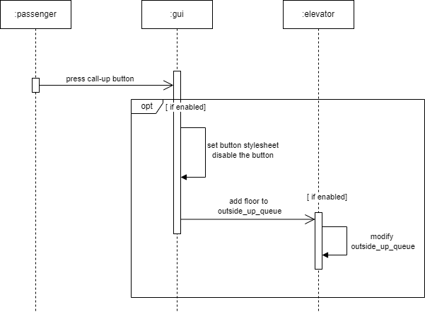
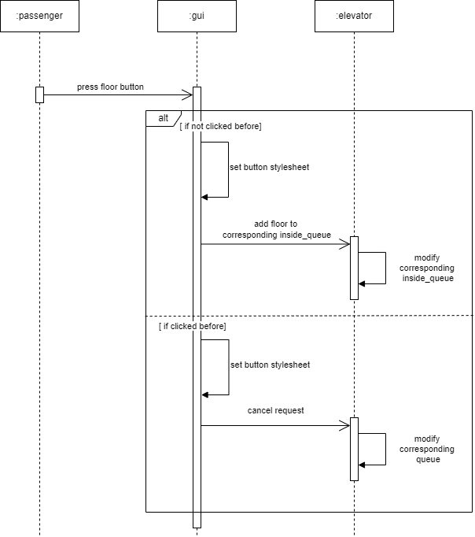
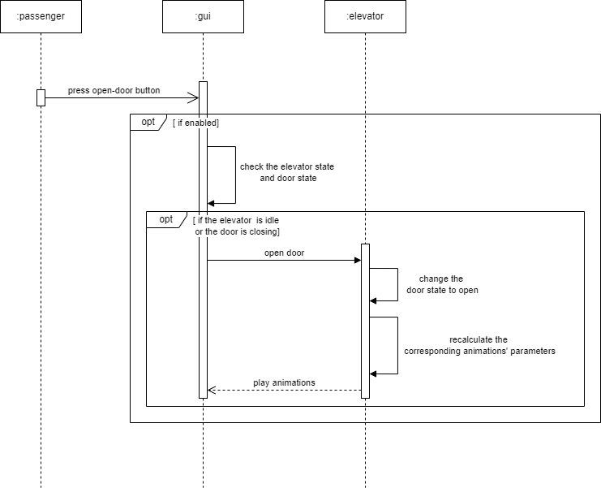
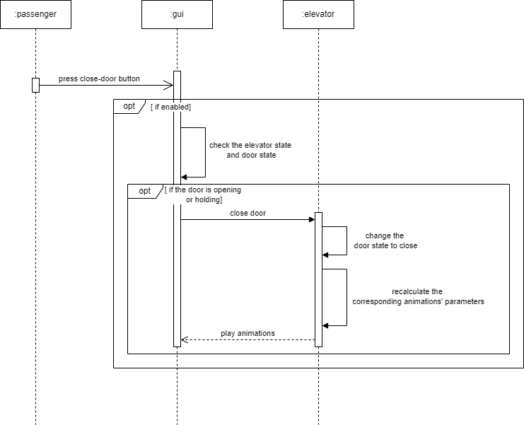
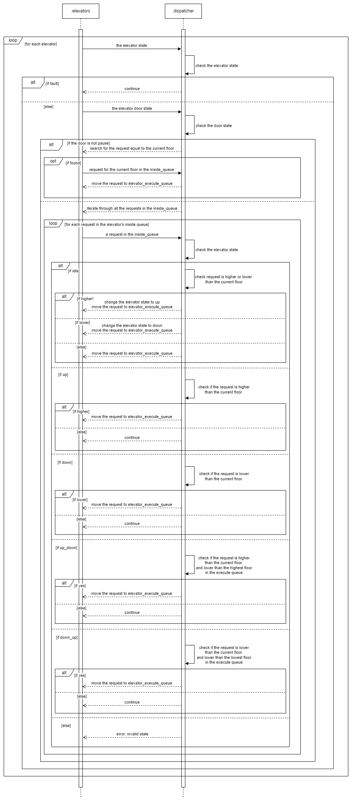
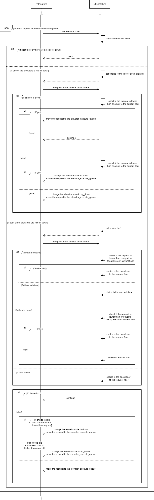
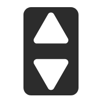

# Specification for Elevator
Team 5 Project 1
Made by: Panxin Tao

---

## Content
- [Specification for Elevator](#specification-for-elevator)
  - [Content](#content)
  - [Introduction](#introduction)
  - [System Architecture](#system-architecture)
  - [Software Specification](#software-specification)
    - [S1:Call-up/call-down button implementation](#s1call-upcall-down-button-implementation)
      - [S1.1:Click implementation](#s11click-implementation)
      - [S1.2:Display implementation](#s12display-implementation)
    - [S2:Floor button implementation](#s2floor-button-implementation)
      - [S2.1:Click implmentation](#s21click-implmentation)
      - [S2.2:Display implementation](#s22display-implementation)
    - [S3:Open-door/close-door button implementation](#s3open-doorclose-door-button-implementation)
      - [S3.1:Click implementation](#s31click-implementation)
      - [S3.2:Display implementation](#s32display-implementation)
    - [S4:Dispatcher implementation](#s4dispatcher-implementation)
      - [S4.1:Inside queue dispatch](#s41inside-queue-dispatch)
      - [S4.2:Outside queue dispatch](#s42outside-queue-dispatch)
        - [S4.2.1:Call-up queue dispatch](#s421call-up-queue-dispatch)
        - [S4.2.2:Call-down queue dispatch](#s422call-down-queue-dispatch)
    - [S5:Update implementation](#s5update-implementation)
      - [S5.1:State display update](#s51state-display-update)
      - [S5.2:Floor LCD update](#s52floor-lcd-update)
      - [S5.3:Elevator current floor update](#s53elevator-current-floor-update)
      - [S5.4:Elevator door state update](#s54elevator-door-state-update)
      - [S5.5:Elevator state update](#s55elevator-state-update)
      - [S5.6:Animation](#s56animation)
        - [S5.6.1:Elevator car animation](#s561elevator-car-animation)
        - [S5.6.2:Elevator door animation](#s562elevator-door-animation)

---

## Introduction
This project realizes an elevator simulator application with PyQt5. The simulator models the situation that there are two elevators and four floor (-1F to 3F). 

It features the dispatcher with relatively excellent performance and high stability. The super-smooth animation is also one of the elaborated features.

---

## System Architecture
The system architecture is showed below:

---

## Software Specification
In this part, we will probe into the specific implementation of the whole system, including every button in the GUI, the controller of the system, and the dispatcher with the help of sequence disgrams.

Here, we should first clarify the five queues related to the implementation of the buttons and the dispatcher. They are *outside_up_queue*, the *outside_down_queue*, the *inside_queue*, *elevator_execute_queue* and *elevator_execute_trace_queue*.

The *outside_up_queue* and the *outside_down_queue* are both lists, containing the requests from the **call-up**/**call-down** buttons respectively. They are shared by the two elevators, which means both of the elevators can receive the requests from the outside buttons.

The *inside_queue* is a list of lists, with each sublist contains the requests from the corresponding elevator's floor buttons respectively. This ensures both of the two elevators can handle their inside requests correctly.

The *elevator_execute_queue* is also a list of lists, with each sublist contains the requests the corresponding elevator is currently dealing with.

The *elevator_execute_trace_queue* is similar to the *elevator_execute_queue*. The difference is that it traces where each element in the *elevator_execute_queue* is from. This helps the implementation of some further features and the concurrency of the frontend and backend test. (to be implemented)

Note that all the elements in each list or sublist mentioned above are unidentical and ascending-ordered.

It is also necessary to clarify the classification of the elevator state and the elevator door state.

For the elevator, there are six kinds of state, which are **IDLE**, **UP**, **DOWN**, **UP_DOWN**, **DOWN_UP** and **FAULT**. Four of them are trivial, so we will only explain the **UP_DOWN** and **DOWN_UP**. The **UP_DOWN** state means that the elevator is now going up, but the difference with the **UP** state is that this state is caused by a **call-down** request from a higher floor. The **DOWN_UP** state can be understood in the similar way.

The elevator door state is more straight forward, they are **PAUSE**, **OPEN**, **HOLD** and **CLOSE** in order.

### S1:Call-up/call-down button implementation
The implementation of **call-up** and **call-down buttons** are almost the same. In this part, we will discuss the effect of clicking these buttons on the state of the elevators and the graphic interface.

#### S1.1:Click implementation
After being clicked, the button will be disabled to avoid repetitive operation and the corresponding outside request queue will update. The following sequence diagrams show the details:

#### S1.2:Display implementation
As the button is disabled, the icon of the button will change to the orange one as showed below:

### S2:Floor button implementation
The implementation of **floor buttons** are also similar to **call-up** and **call-down buttons**. The only difference is that when it comes to the **floor button**, we need to find the corresponding elevator and its *inside_queue*.

#### S2.1:Click implmentation 
After being clicked, if it is not clicked before, an inside request to the corresponding floor will be made. If it is clicked before, the corresponding request will be cancelled, but notice that the elevator will not stop immediately because it can only stop at the integer floor instead of between two floors. The implementation details are as following:

#### S2.2:Display implementation
As the button is disabled, the icon of the button will also change to the orange one as showed below:

### S3:Open-door/close-door button implementation
In this part, we will look into another kind of buttons, the **open-door**/**close-door buttons**. Different from the **call-up/call-down buttons** we discussed about before, these buttons have nothing to do with the request queues. They are related to the elevator door state.

#### S3.1:Click implementation
For the **open-door buttons**, after being clicked, the system will check the elevator state and the door state to determine whether the door can open. If the elevator is **IDLE** or the door is **CLOSE**, we will update the corresponding elevator door state to **OPEN** and re-calculate the corresponding animation parameters according to the current geometry attributes of the elevator door. Check the following sequence diagram for details:

For the **close-door buttons**, the trigger condition is that the door is **OPEN** or **HOLD**:

Re-calculating the animation parameters is to ensure the consistency of the animation, which is one of the top features of this application. This process is based on the geometry attributes of the *QtWidgets.QGraphicsView* objects, including the x, y, width and height. The system will use these attributes of both the current left-side and right-side elevator doors to instantiate the *QPropertyAnimation* objects and play the animation.

#### S3.2:Display implementation
While the open-door animation is playing, the corresponding **open-door button** will be set as orange and disabled. It will recover to the initial style and be enabled again at the end of the animation or once the **close-door button** is clicked. 

The **close-door button** works in exactly the same way.

### S4:Dispatcher implementation
The dispatcher is the core of the elevator system. In this part, we will discuss how the dispatcher handles the requests in the *outside_up_queue*, the *outside_down_queue* and the *inside_queue*, and then distributes them to the *elevator_execute_queue* and *elevator_execute_trace_queue*.

#### S4.1:Inside queue dispatch
The dispatching process will start with the *inside queue*. It makes sense because the elevators should first satisfies the requests from the inside passengers. Let's start with the sequence diagram:

Since each elevator has its own isolated *inside_queue*, we can first iterate through the elevators and handle their *inside_queue* respectively. 

First, we should check whether the elevator state is **FAULT**, if so, nothing should be done.

Then, check the door state, if the door is not **PAUSE**, we should only distribute the request to the current floor to the *elevator_execute_queue*, if it is in the *inside_queue*. Otherwise, we will iterate through the *inside_queue* and use the elevator state to make decision.

If the elevator state is **IDLE**, it can take the request no matter to which floor. We will move the request to the *elevator_execute_queue* and update the elevator state according to the comparison between the request floor and the current floor.

If the elevator state is **UP**, it can only handle requests higher than the current floor. In the similar way, if the elevator is **DOWN**, it can only handle requests lower than the current floor.

When it comes to **UP_DOWN** and **DOWN_UP**, things get more complicated. The elevator will only take requests higher than the current floor, and lower than the highest floor in the *elevator_execute_queue*, if the elevator state is **UP_DOWN**. Meanwhile, it will only take requests lower than the current floor, and higher than the lowest floor in the *elevator_execute_queue*, if the elevator state is **DOWN_UP**. Let's probe into it. Remember the **UP_DOWN** state is caused by a **call-down** request from a higher floor. This means the elevator state will change to **DOWN** upon completing this request. To satisfy this **call-down** request, we should not go to higher floor before we pick up this passenger. The situation of **DOWN_UP** state is the same.

#### S4.2:Outside queue dispatch
The implementation of dispatching the outside requests is more complicated, because both the *outside_up_queue* and *outside_down_queue* are shared by the elevators, which means for some requests, both of the elevators can handle it. Therefore, we should decide which elevator can handle it more efficiently.

##### S4.2.1:Call-up queue dispatch
We will first deal with the call-up requests for nothing special. Here's the sequence diagram depicting this process:

We will iterate through the *outside_up_queue* to determine where each elements should go. 

Only elevators with the state **IDLE** or **UP** can take the call-up request, which is necessary but not sufficient condition. There is no doubt that the **IDLE** elevators can take the request. For **UP** elevators, chances are that they can settle the request by the eay. For **DOWN** and **DOWN_UP** elevators, it tends to take longer time to execute the request. And for **UP_DOWN** elevators, it is very posiible to bring into conflict between the passenger who wants to go down and the call-up request.

If neither of the elevators meets the state condition, we will break and wait for the next dispatching process to handle the requests.

If one of the elevators meets the state condition, we will anchor our hope on this elevator. If the elevator is **IDLE**, it can take this request, and we should update its state and move the request from the *outside_up_queue* to the *elevator_execute_queue*. If the elevator is **UP**, we will further check whether the request floor is higher than the current floor. If yes, then the elevator can handle this request by the way, so we should move it to the *elevator_execute_queue*.

If both of the elevators meets the state condition, first check whether the request is higher than the **UP** elevator(s). If so, we should make a tradeoff, calculating the elevator closer to the floor to take the request.

##### S4.2.2:Call-down queue dispatch
The implementation of dispatching the call-down queue is similar to the one of call-up. We will only show the sequence diagram here, please read it combined with the interpretation of the call-up one above.

### S5:Update implementation
This section is about the update implementation of the elevator system, especially the GUI update.

#### S5.1:State display update
The state display both inside and outside will update according to the corresponding elevator's state.

If the elevator is **IDLE**, the corresponding five state displays(one inside, four outside) will be:

If the elevator is **UP** or **UP_DOWN**, the state display will be:

If the elevator is **DOWN** or **DOWN_UP**, the state display will be:

#### S5.2:Floor LCD update
The floor LCD both inside and outside will update to the corresponding elevator current floor if and only if the current floor is an integer. This fits with the common sense and can handle both up and down elevators.

#### S5.3:Elevator current floor update
If the elevator door state is **PAUSE**, the elevator can move. Then if the elevator state is **UP** or **UP_DOWN**, the current floor will plus *elevator_speed*. Then if the elevator state is **DOWN** or **DOWN_UP**, the current floor will minus *elevator_speed*.

Otherwise, the current floor will not change.

#### S5.4:Elevator door state update
If the elevator door state is **PAUSE** and the current floor is in *elevator_execute_queue*, the door state will change to OPEN and the corresponding animation will be played.

If the elevator door state is not **PAUSE**, then it will change according to **OPEN**->**HOLD**->**CLOSE**->**PAUSE** in turn.

#### S5.5:Elevator state update
The elevator state will update only if the current floor is integer. This is to ensure the elevator will not stop between two floors.

Then if the *elevator_execute_queue* is empty, the elevator state will update. If it is **UP** or **DOWN**, it will update to **IDLE**. If it is **UP_DOWN**, it will update to **DOWN**. If it is **DOWN_UP**, it will update to **UP**.

#### S5.6:Animation 
##### S5.6.1:Elevator car animation
The elevator car animation will be played if and only if the current floor changes. Then it will recalculate the animation parameters according to the current floor and whether the elevator is going up or down.

##### S5.6.2:Elevator door animation
The elevator door animation will update and play in the following three conditions:
1. The elevator arrives at target floor, and the inside door and the corresponding outside door will update and play open door animation.
2. After the door is opened and holds for some time, close door animation will be played.
3. A request from the open/close-door button.

Notice that the elevator door state is meaningful only at the update moment, but the animation is an ongoing process. So, the door **OPEN** means the door is opened when we first scout it at the update moment and **CLOSE** means the door is closed. So, we need to play close door animation when we scout **HOLD** state at the update moment, which indicates the hold time is over.