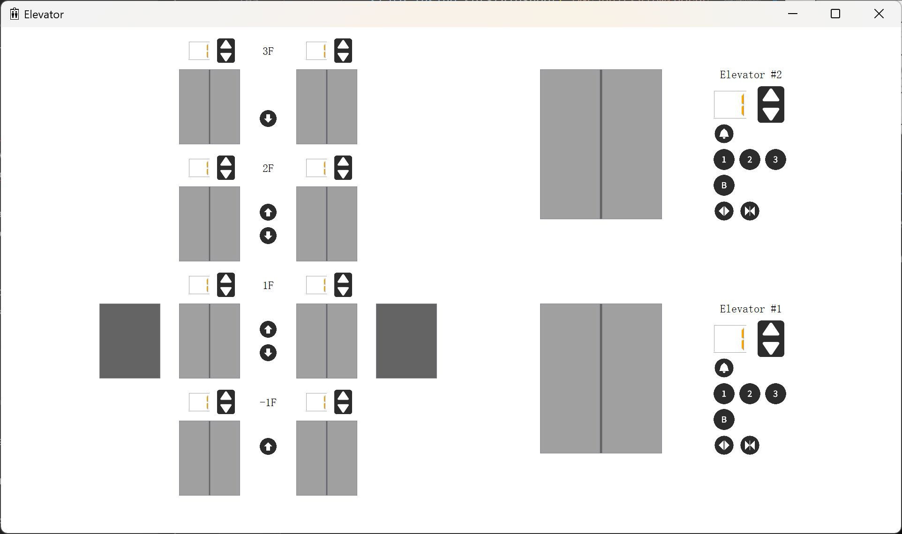
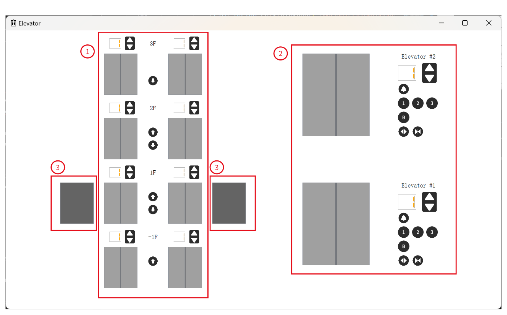
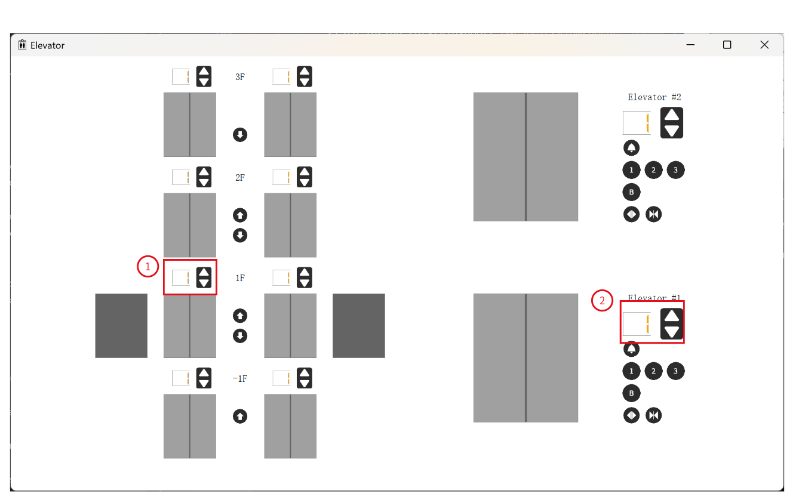
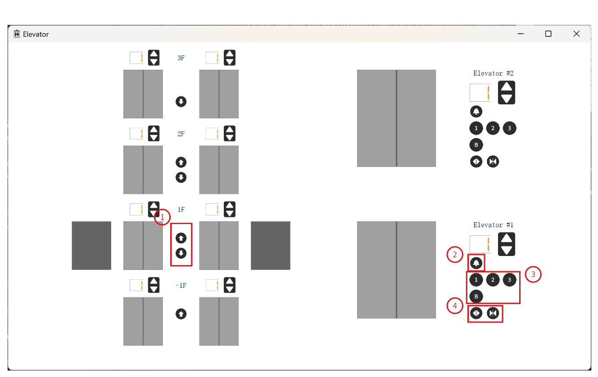
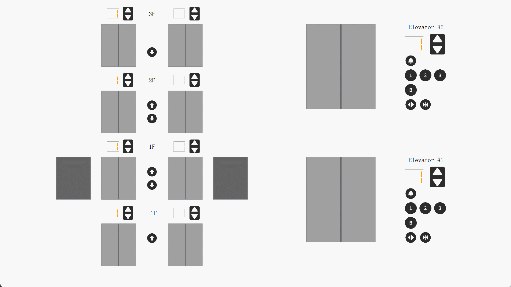
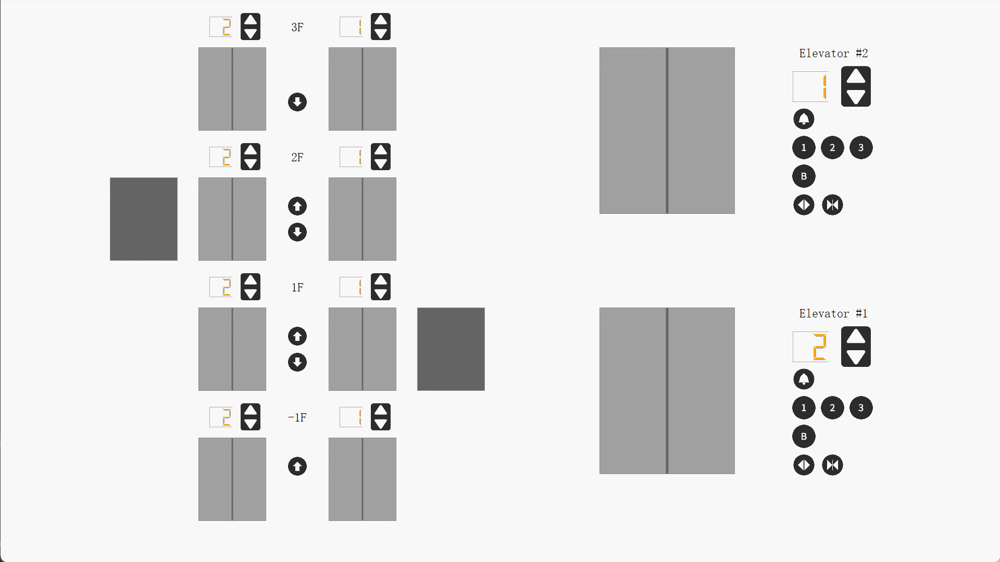

# User Manual for Elevator
Team 5 Project 1
Made by Panxin Tao

---

## Content
- [User Manual for Elevator](#user-manual-for-elevator)
  - [Content](#content)
  - [Getting Started](#getting-started)
    - [Installation](#installation)
    - [How to run](#how-to-run)
  - [Introduction](#introduction)
  - [System Architecture](#system-architecture)
  - [Player Manual](#player-manual)
    - [Main Window](#main-window)
      - [GUI Components](#gui-components)
      - [Status display](#status-display)
      - [Buttons](#buttons)
    - [Animations](#animations)
      - [Elevator car moving animation](#elevator-car-moving-animation)
      - [Open-door/Close-door animation](#open-doorclose-door-animation)
  - [Project Struct](#project-struct)

---

## Getting Started
### Installation
To run this application, you need Python 3.10 or higher and PyQt5, pyzmq installed in your python environment. Follow the following steps to set up:
- Install Python 3.10+ from the official website, you can check whether the installation is successful and the Python version using the following command:
    ```
    python --version
    ```
- Open the terminal and install PyQt5 and pyzmq using the following command:
    ```
    pip install PyQt5, pyzmq
    ```

### How to run
Go to the project folder(~/Elevator), and use the following command to run the program:
```
cd ./src/
python main.py
```

---

## Introduction
This project realizes an elevator simulator application with PyQt5. The simulator models the situation that there are two elevators and four floor (-1F to 3F). 

It features the dispatcher with relatively excellent performance and high stability. The super-smooth animation is also one of the elaborated features.

---

## System Architecture
The system architecture is shown below:


---

## Player Manual
### Main Window
The GUI is shown below:
  

#### GUI Components
The GUI can be divided into three parts as following:

1. ① shows the outside of the elevators, with two elevators and four floors, which is 8 doors in total. It also contains floor LCDs, state lights and call-up/call-down buttons.
2. ② shows the inside of the elevators, with one door, one floor LCD and one state light each, and the emergency buttons, the floor buttons and open-door/close-door buttons.
3. ③ shows the elevator cars, demonstrating which floor the elevators are on.

#### Status display
The status display contains two components: the lcd showing the elevator's current floor and the state light showing the elevator's current state. There are two kinds of them:

1. The outside status displays are above the outside elevator doors.
2. The inside status displays are above the inside button panel.

#### Buttons
There are four kinds of buttons as following:

1. ① are call-up/call-down buttons. Each floor has a pair of them, except for the bottom and top floor. They are used to call-up/call-down from the outside of the elevator. 
   After being clicked one of them, it will be disabled and cannot be clicked again until the request is handled.
2. ② are emergency buttons. Each elevator has one.
   After being clicked, the correspending elevator will cancel all the inside requests, go to the first floor and stay opened until the emergency button is clicked again (it cannot be clicked again until the elevator arrives at the first floor). The other inside buttons cannot be clicked during this period. (to be implemented)
3. ③ are floor buttons. Each elevator has a set of them.
   After being clicked one of them, if it is not clicked before, an inside request to the corresponding floor will be made. If it is clicked before, the corresponding request will be cancelled, but notice that the elevator will not stop immediately because it can only stop at the integer floor instead of between two floors.
   You can make an inside request to a floor in the opposite direction, but it will be cancelled when the elevator completes all the requests it is executing.
4. ④ are open-door/close-door buttons. Each elevator has a pair of them.
   After the open-door button is clicked, if the corresponding elevator is not moving, the door will open. The button will be disabled and cannot be clicked again until the door is opened.
   After the close-door button is clicked, if the corresponding elevator door is opening or opened, it will close. The button will be disabled and cannot be clicked again until the door is closed.

### Animations
The super-smooth animation is one of the top features of this application. There are two kinds of animations: the elevator car moving animation and the open/close door animation.

#### Elevator car moving animation
The animation is shown below,

this animation can calculate the start floor and end floor of the elevator car, and then play it accurately.

#### Open-door/Close-door animation
The open-door animation is shown below,

it can also work when the door is closing,


The close-door animation is shown below,


Both of the animations can work when another animation is playing. In this situation, it will interrupt another animation and re-calculate the start parameters and end parameters.

---

## Project Struct

- [**main.py:**](../../src/main.py) Initializes and runs the main application.
- [**Elevators.py:**](../../src/Elevators.py) Contains the positions, animations and states of the elevators.
- [**NetClient.py:**](../../src/NetClient.py) Manages the messages from the test program.
- [**Porter.py:**](../../src/Porter.py) Handles the messages from the NetClient and interacts with the system.
- [**GUI.py:**](../../src/GUI.py) Initializes the interface of the application and defines the api of the buttons.
- [**Dispatcher.py:**](../../src/Dispatcher.py) The controller of the system. Contains the Porter and Dispatcher. Decides the operating strategy and updates the interface.