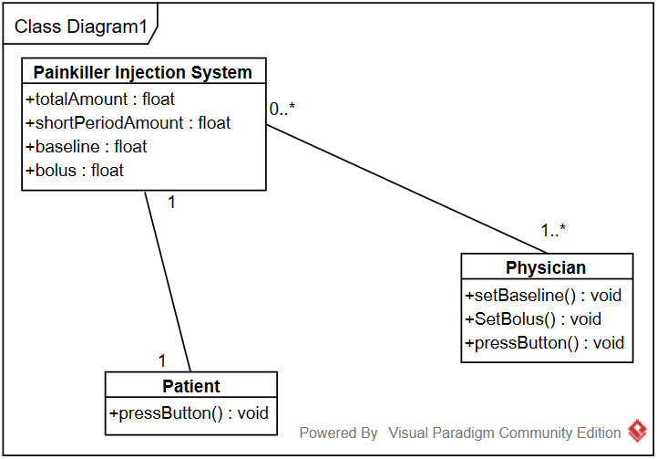
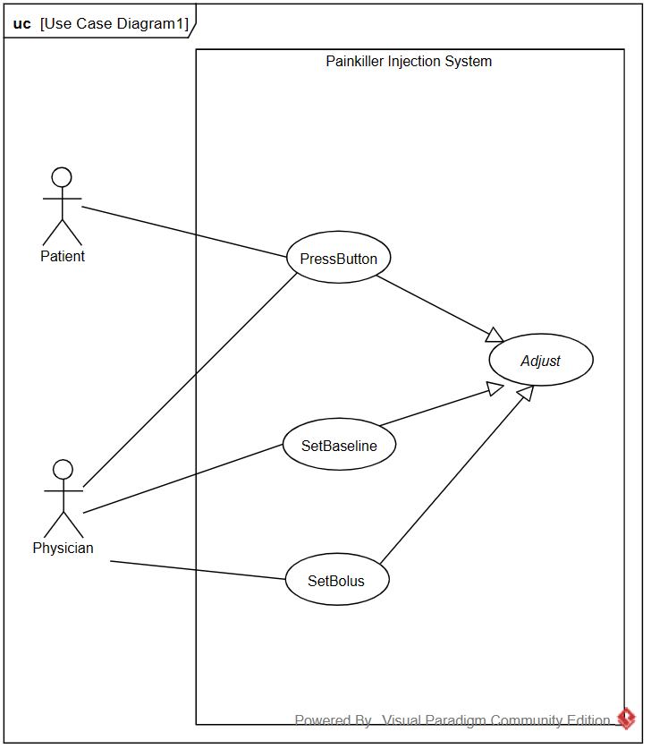
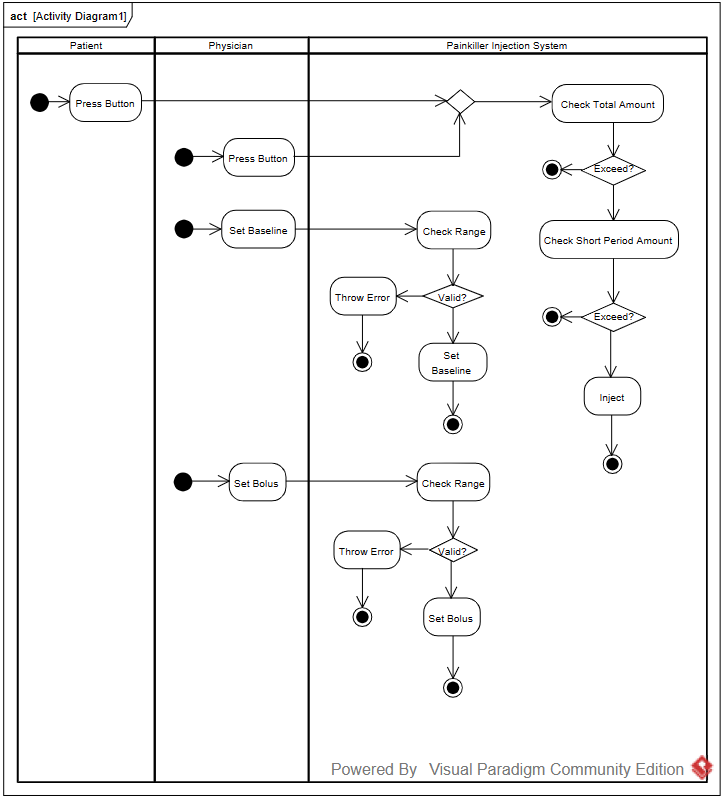

# Project Requirements Document
### Project3 Painkiller Injection System  

**Requirement**: Panxin Tao 2022533112

**Development**: Zhekai Zhang 2022533057

**Validation**: Runkang Yang 2022533080

Update 2024/4/24

ver 0.2

---

### 1. Introduction

The Painkiller Injection System is designed to automate the delivery of painkillers to patients post-surgery. This document outlines the functional and non-functional requirements for the system.

---

### 2. System Overview

- **Objective**: Automates the delivery of painkillers within prescribed limits to ensure patient comfort and safety.

- **Components**:
  - **Medication Delivery Unit**: Controls the dosage and frequency of painkiller injections.
  - **User Interface**: 
    - Allows physicians to set parameters  
    - Allows anyone reasonable to request additional doses.

---

### 3. Functional Requirements

- Dosage Control:
    - Total Daily Limit: The system shall not exceed a total of 3ml of painkiller every 24 hours.
    - Hourly Limit: The system shall not deliver more than 1ml of painkiller every one hour.
  
- Baseline Delivery:
    - Upon the parameter physician sets, the system shall administer a continuous baseline painkiller dose ranging from 0.01ml to 0.1ml per minute.

- Bolus Dose:
    - Upon request, the system shall deliver a bolus dose ranging from 0.2ml to 0.5ml per shot (which is also set by the phydician), without exceeding the total daily limit and hourly limit.

---

### 4. Non-Functional Requirements

- **Safety**: The system shall incorporate safety checks to prevent overdose.

- **Reliability**: The system shall function continuously without failure for a minimum of 72 hours.

- **Usability**: The interface shall be intuitive for both physicians and patients.

---

### 5. Specific divisions

R1: Physician Interface Operations

- **R1.1: Adjust baseline and bolus amount.** Make sure not to exceed the given ranges. The baseline can only be adjusted when the baseline switch is off.

- **R1.2: Baseline switch.** The switch can be toggled. When the switch is on and the limits aren't exceeded, the baseline should remain being injected.

- **R1.3: Reset.**

R2: Patient Interface Operations

- **R2.1: Request bolus.** Inject when the limit is not exceed.

R3: Backend.

- **R3.1: Update.**

- **R3.2: States and past 1 or 24 hours calculations.**
---

### 6. User Interface

- Physician Interface:
    - Physicians shall be able to input patient-specific dosage parameters, e.g. injection baseline, and view injection logs.

- Patient Button:
    - A button shall be accessible to anyone reasonable to administer a bolus dose as needed, within the limits.

---

### 7. Domain Analysis

- Class Diagram:

- Use Case Diagram:

- Activity Diagram:

